# MemPenny

**Your Claude memory companion. Turn it on, keep it lean, schedule the upkeep, reverse anything.**

[](LICENSE)
[](CHANGELOG.md)
[](#install)
[](SECURITY.md)
[](SECURITY.md)
[](locales/README.md)

Claude's memory grows. Old notes pile up. The signal gets buried. MemPenny tidies it — and Claude's next session starts sharper.

It also keeps memory from ever concentrating into one runaway file. A fixed, AI-friendly structure — organized by topic, sharded by year as it grows — so no single file ever outgrows what's actually useful.

| | Files | Size |
|---|---:|---:|
| Before | 424 | 1,247 KB |
| After | 227 | 458 KB |
| **Change** | **−46%** | **−63%** |

A real second-pass run; full case study: [Real-world results](docs/real-world-results.md).

Two ways:

- **Clean now** — `/mempenny:clean`. One command. Minute or two. You see the proposal, say yes, done.
- **Set a learning nap** — `/mempenny:nap`. Pick a schedule (daily / weekly / once). MemPenny tidies on your next Claude Code session — backup-first, no prompts, fully reversible. Each pass leaves Claude with cleaner notes to learn from next time.

What it does:

- Drops what's clearly stale.
- Files away historical stuff (still searchable, just out of the way).
- Trims bloated notes to one or two lines.
- Spots duplicates and keeps the best one.
- Flags files that contradict each other so you can sort them out.
- Organizes what's kept into a fixed set of topic files, so nothing sprawls into hundreds of one-off notes. *(New in v1.1 — existing projects convert automatically.)*
- Leaves alone files and folders you mark off-limits.

Don't like a change? `/mempenny:restore` puts everything back. Backup-first, always.

## How memory is organized

Three levels, max — a cold Claude session never needs more than 3 file-opens to find anything.

```mermaid
%%{init: {"theme": "base", "themeVariables": {"fontFamily": "Inter, ui-sans-serif, system-ui, sans-serif", "background": "transparent", "primaryTextColor": "#172033", "lineColor": "#9AA8C7"}}}%%
flowchart TB
    M(["✦ MEMORY.md<br/><small>tiny index · 8 fixed routes</small>"])

    M --> C["🧭 charter.md<br/><small>goal & requirements</small>"]
    M --> P["⚡ pending.md<br/><small>in-flight work</small>"]
    M --> T["⚠️ traps.md<br/><small>hazards discovered</small>"]
    M --> R["📜 rules.md<br/><small>standing AI rules</small>"]
    M --> F["🔎 reference.md<br/><small>people · systems · glossary</small>"]
    M --> W["🚢 worklog.md<br/><small>shipped changes</small>"]
    M --> S["🤝 support.md<br/><small>help given</small>"]
    M --> D["⚖️ decisions.md<br/><small>why X over Y</small>"]

    classDef root fill:#172033,stroke:#6EE7B7,stroke-width:3px,color:#FFFFFF;
    classDef charter fill:#EAF7FF,stroke:#38BDF8,stroke-width:2px,color:#172033;
    classDef pending fill:#FFF7E6,stroke:#F59E0B,stroke-width:2px,color:#172033;
    classDef traps fill:#FFF1F2,stroke:#F43F5E,stroke-width:2px,color:#172033;
    classDef rules fill:#F5F3FF,stroke:#8B5CF6,stroke-width:2px,color:#172033;
    classDef reference fill:#ECFDF5,stroke:#10B981,stroke-width:2px,color:#172033;
    classDef worklog fill:#EEF2FF,stroke:#6366F1,stroke-width:2px,color:#172033;
    classDef support fill:#F0FDFA,stroke:#14B8A6,stroke-width:2px,color:#172033;
    classDef decisions fill:#F8FAFC,stroke:#64748B,stroke-width:2px,color:#172033;

    class M root;
    class C charter;
    class P pending;
    class T traps;
    class R rules;
    class F reference;
    class W worklog;
    class S support;
    class D decisions;
```



`charter`/`pending` never auto-reduce (they're exempt — distilling requirements is destructive). `traps`/`rules`/`reference` get curated entry-by-entry in place once they grow too large. `worklog`/`support`/`decisions` shard into locked, frozen yearly files instead, once a year closes out — the active file stays current-year-sized forever.

Full spec: [docs/memory-taxonomy-design.md](docs/memory-taxonomy-design.md).

## Install

```
/plugin marketplace add marcelopaniza/mempenny
/plugin install mempenny@mempenny
/reload-plugins
```

## Requirements

- Claude Code with auto-memory enabled. (MemPenny detects if it's off and offers to turn it on.)

## License

MIT — see [LICENSE](./LICENSE).

---

## Advanced

Full command reference, flags, config schema, manual rollback, backup retention, localization, and how it all works under the hood: **[docs/advanced.md](docs/advanced.md)**.

Design spec for the topic taxonomy specifically: [docs/memory-taxonomy-design.md](docs/memory-taxonomy-design.md).
