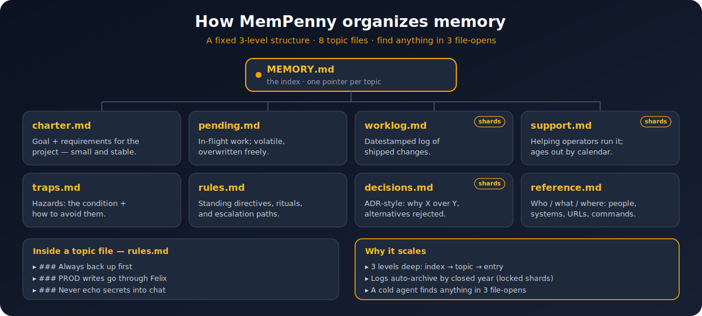

# MemPenny

<p align="center"></p>

**Memory hygiene for any AI coding agent — not a one-off clean. MemPenny organizes your memory, cleans out the stale, and keeps it that way.**

[](LICENSE)
[](CHANGELOG.md)
[](#install)
[](SECURITY.md)
[](locales/README.md)

Your agent's memory grows. Old notes pile up and the signal gets buried. MemPenny doesn't just tidy once — it does three things:

1. **Organize** — every note lands in a small, fixed set of topic files. A 3-level structure (one-line index → topic files → entries inside) keeps things from sprawling into hundreds of one-off notes; a cold agent finds anything in three file-opens.
2. **Clean** — drop what's stale, archive the historical, distill the bloated to a line or two, kill duplicates, and flag files that contradict each other.
3. **Keep it cleaned** — set a schedule (daily / weekly / once) and the next session opens on a tidy directory. Backup-first, fully reversible.

## How memory is organized

Every tidy memory settles into the same fixed shape — so a cold agent always knows where to look:

<p align="center"></p>

It runs on **Claude Code** and **opencode**, and any agent that reads an `AGENTS.md` (Codex, Gemini, CodeWhale, Swival, Cursor, Windsurf, and friends). Same memory directory, same commands, same safety net. If you switch hosts mid-project, the tidied memory comes with you.

## Before / after

| | Files | Size |
|---|---:|---:|
| Before | 424 | 1,247 KB |
| After | 227 | 458 KB |
| **Change** | **−46%** | **−63%** |

A real second-pass run on a real memory directory. Full case study: [docs/real-world-results.md](docs/real-world-results.md).

## Two ways to use it

- **Clean now** — one command. You see the proposal, you say yes, done. A minute or two.
- **Set a nap** — pick a schedule (daily / weekly / once). MemPenny tidies on your next session. Backup-first, no prompts, fully reversible.

## Install

**Claude Code**

```
/plugin marketplace add marcelopaniza/mempenny
/plugin install mempenny@mempenny
/reload-plugins
```

**opencode** (available from v1.2.0)

```bash
git clone https://github.com/marcelopaniza/mempenny.git
cd mempenny && git checkout v1.3.0
./install/opencode.sh
```

Commands are `/mempenny-clean`, `/mempenny-nap`, `/mempenny-restore`, `/mempenny-memory-*` (hyphen, not colon). If you also run Claude Code in this project, the two hosts share the same memory directory and config automatically — zero setup.

**Other agents** — MemPenny ships the native adapter file each host expects (a plugin manifest, a rules file, or a skill) plus `AGENTS.md` at the root. Pick your host:

| Host | Install |
|---|---|
| Codex | `codex plugin marketplace add marcelopaniza/mempenny`, then `/plugins` → install mempenny |
| Gemini | `gemini extensions install https://github.com/marcelopaniza/mempenny` |
| Antigravity (`agy`) | `agy plugin install https://github.com/marcelopaniza/mempenny` |
| Devin | `devin plugins install marcelopaniza/mempenny` |
| Hermes | `hermes plugins install marcelopaniza/mempenny --enable` |
| OpenClaw | `clawhub install mempenny` |
| Swival | `swival skills add --global https://github.com/marcelopaniza/mempenny` |
| Cursor | copy [`.cursor/rules/mempenny.mdc`](.cursor/rules/mempenny.mdc) into your project |
| Windsurf | copy [`.windsurf/rules/mempenny.md`](.windsurf/rules/mempenny.md) |
| Cline | copy [`.clinerules/mempenny.md`](.clinerules/mempenny.md) |
| Kiro | copy [`.kiro/steering/mempenny.md`](.kiro/steering/mempenny.md) into `~/.kiro/steering/` |
| Copilot | copy [`.github/copilot-instructions.md`](.github/copilot-instructions.md) into your project |
| CodeWhale | nothing to do — reads `AGENTS.md` automatically |

These get the **rules-only** tier (strategy, guards, write-time discipline); the scheduled nap runs only on Claude Code and opencode (it's a lifecycle hook, and these hosts have no equivalent). Full matrix and rationale: [docs/host-and-model-compat.md](docs/host-and-model-compat.md).

## Supported hosts & models

| Host | Clean / Restore | Scheduled nap |
|---|:---:|:---:|
| Claude Code | ✅ | ✅ |
| opencode | ✅ | ✅ |
| Codex / Gemini / Devin | rules-only | — |
| Cursor / Windsurf / Cline / Kiro / Copilot | rules-only | — |
| CodeWhale / Swival / OpenClaw | rules-only | — |

On opencode, a scheduled nap fires a desktop notification pointing at `/mempenny-clean`; auto-invoke is reserved for a future release.

MemPenny is tuned on Claude Sonnet/Opus and runs on GLM 4.6+, GPT-5, and Gemini 2.5. **Conservation is non-negotiable on every model** — a scripted check verifies nothing is lost before anything old is deleted. Distillation quality varies by model; see the compat doc for per-model notes.

## Commands

| Command | What it does |
|---|---|
| `/mempenny-clean` | One-shot tidy: triage → show → apply. Backup-first. |
| `/mempenny-nap` | Schedule a recurring clean. |
| `/mempenny-restore` | Reverse any pass. |
| `/mempenny-memory-triage` | Dry-run: propose actions, change nothing. |
| `/mempenny-memory-apply` | Apply a triage table. |
| `/mempenny-memory-distill` | Shrink one file to its load-bearing lines. |
| `/mempenny-memory-curate` | Reduce a topic file entry-by-entry. |
| `/mempenny-memory-shard-roll` | Close a finished year into a locked shard. |

Claude Code uses the colon namespace (`/mempenny:clean`, etc.) — same commands, two spellings.

## Safety, in one screen

- **Backup-first.** Every change is preceded by a full backup. `/mempenny-restore` reverses anything.
- **Nothing lost.** A scripted conservation check runs before any old file is deleted.
- **Path-locked.** Tight validation on every path and filename; symlinks refused at sensitive points.
- **Off-limits by default.** A `.mempenny-lock` file or a `<!-- mempenny-lock -->` comment opts anything out.

Full threat model and every codenamed guard: [SECURITY.md](SECURITY.md).

## Advanced

Full command reference, flags, config schema, the topic taxonomy, backup retention, localization, and how it all works under the hood: **[docs/advanced.md](docs/advanced.md)**.

## License

MIT — see [LICENSE](./LICENSE).
